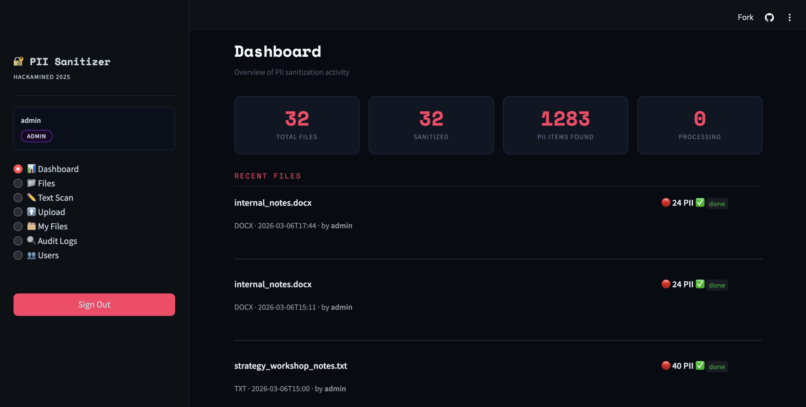
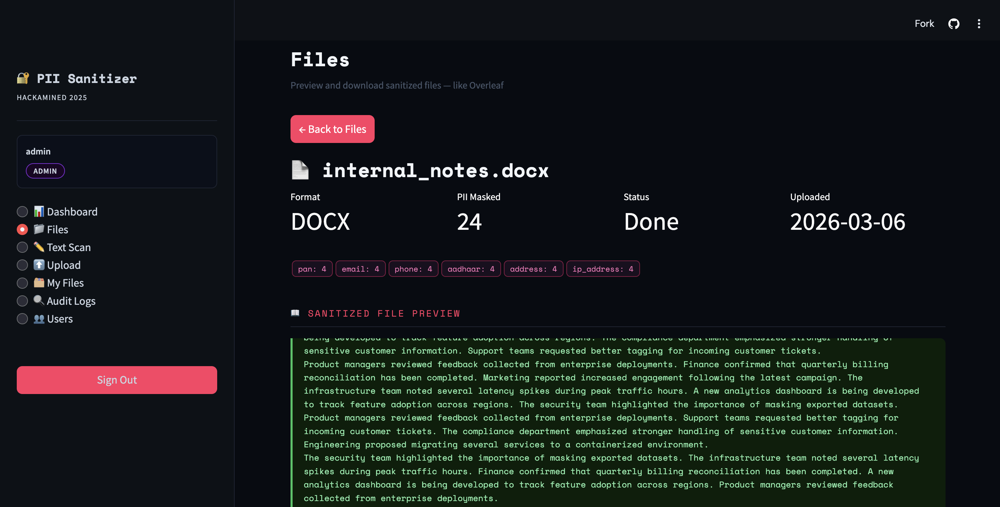
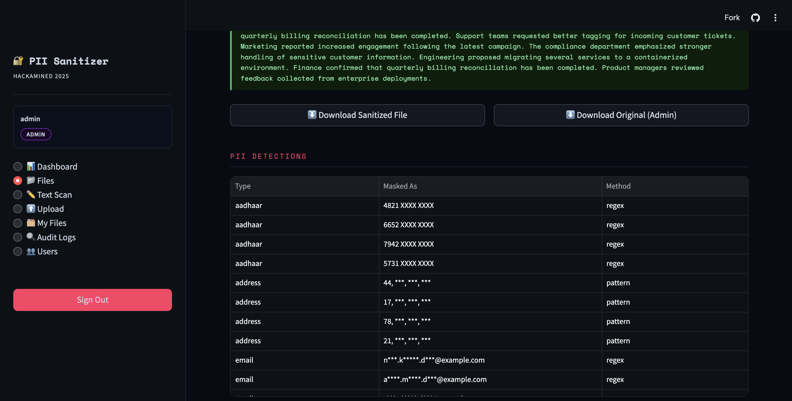
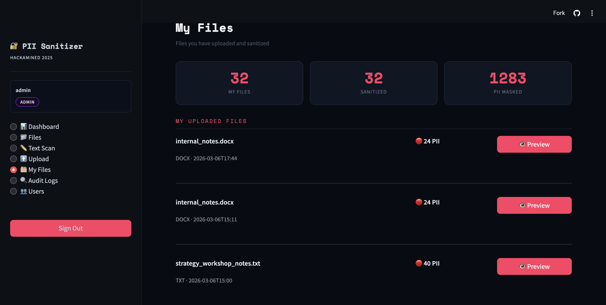
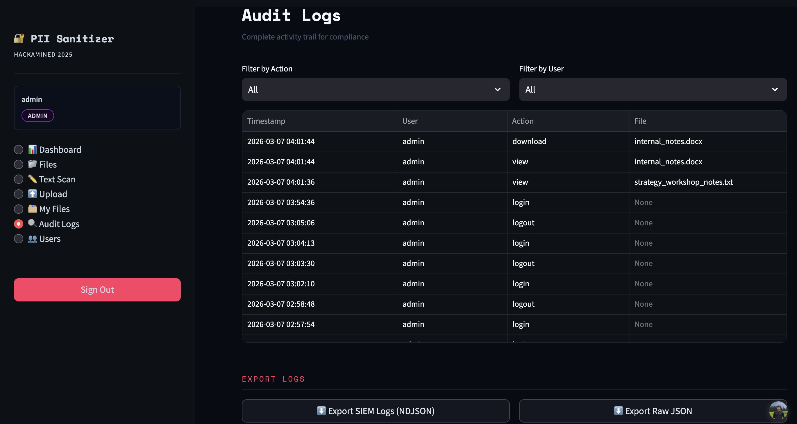
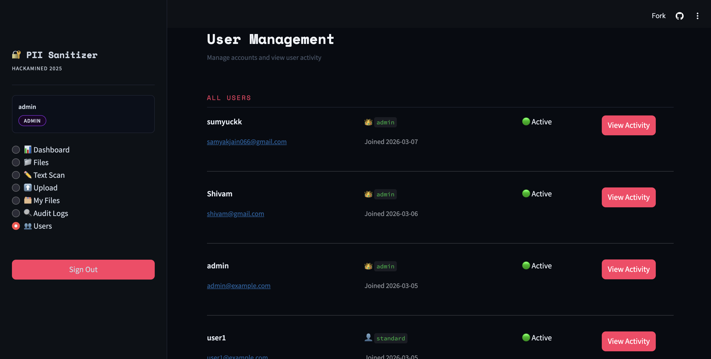
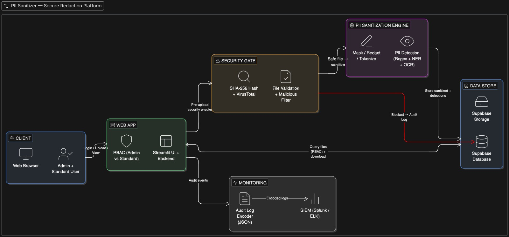
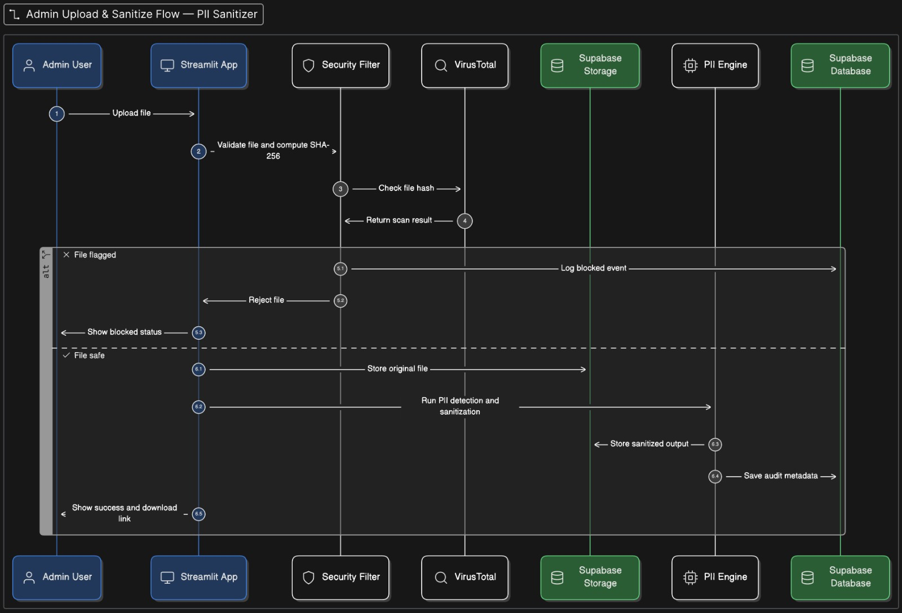

# PII Sanitizer

This is our submission for **Nirma HACKaMINeD 2026**.

**Live Website:** [Open the deployed app](https://hackpro-edgzvyx3ogrbcavazubtpz.streamlit.app/)

---

## Overview

PII Sanitizer is a secure document sanitization platform built for environments where sensitive data must be protected before storage, sharing, or downstream usage.

The system supports end-to-end sanitization of documents containing synthetic PII by combining:

- **Regex-based structured PII detection**
- **NLP-based contextual entity recognition**
- **OCR-assisted image redaction**
- **Role-based file access**
- **Security checks before upload**
- **Audit logging for every critical action**

Admins can upload sensitive files, scan and sanitize them, review detections, and manage users. Standard users can only access sanitized outputs.

---

## Screenshots

### Admin Dashboard
<p align="center">
  
</p>

### Upload & PII Detection
<p align="center">
  
</p>

### Sanitized Output Preview
<p align="center">
  
</p>

### File Management
<p align="center">
  
</p>

### Audit Logs
<p align="center">
  
</p>

### User Management
<p align="center">
  
</p>

---

## Architecture

<p align="center">
  
</p>

The platform follows a secure document-processing pipeline:

- User authentication and RBAC through the application layer
- File validation before upload
- Hash generation and malware check workflow
- PII detection and sanitization engine
- Secure storage of original and sanitized artifacts
- Structured audit event generation for monitoring systems

---

## Admin Flow

<p align="center">
  
</p>

This flow captures the complete admin journey:
authentication → upload → validation → scan → sanitize → store → review → download.

---

## Key Features

### PII Detection & Redaction
- Detects structured PII such as:
  - Email
  - Phone number
  - PAN
  - Aadhaar
  - IP address
- Detects contextual entities using NLP:
  - Names
  - Locations
- Supports masking/redaction while preserving file type

### Multi-Format Support
- **PDF → PDF**
- **DOCX → DOCX**
- **SQL → SQL**
- **CSV → CSV**
- **TXT → TXT**
- **JSON → JSON**
- **Images → Images** using OCR-assisted redaction

### Role-Based Access Control
- **Admin**
  - Upload and scan files
  - View detailed detections
  - Access original and sanitized files
  - Review audit logs
  - Manage users
- **Standard User**
  - Access only sanitized outputs

### Security Controls
- File validation before processing
- Suspicious/malicious content filtering before upload
- File hash generation
- VirusTotal API-based verification workflow
- Audit logs for:
  - Login
  - Upload
  - Access
  - Download
- Audit logs generated in a structured backend format suitable for SIEM ingestion

---

## Tech Stack

| Layer | Technology |
|------|------------|
| Frontend + App Layer | Streamlit |
| Backend Logic | Python |
| Authentication / Data | Supabase |
| File Storage | Supabase Storage |
| PII Detection | Regex + SpaCy NLP |
| OCR | Tesseract + pytesseract |
| Document Processing | pdfplumber, python-docx, reportlab, PIL |
| Security | VirusTotal API, hashing, audit logging |

---

## Project Structure

```bash
.
├── app.py
├── auth.py
├── database.py
├── storage.py
├── file_processor.py
├── pii_engine.py
├── requirements.txt
├── assets/
│   ├── screenshots/
│   └── diagrams/
└── README.md
```

---

## Local Setup

### 1. Clone the repository
```bash
git clone https://github.com/your-username/your-repo-name.git
cd your-repo-name
```

### 2. Create a virtual environment
```bash
python -m venv venv
source venv/bin/activate
```

### 3. Install dependencies
```bash
pip install -r requirements.txt
```

### 4. Add environment variables
Create a .env file in the root directory:
```bash
SUPABASE_URL=your_supabase_url
SUPABASE_KEY=your_supabase_key
VIRUSTOTAL_API_KEY=your_virustotal_api_key
```

### 5. Run the app
```bash
streamlit run app.py
```

---


## Security Considerations

This project was built with a security-first approach.

- Uploaded files are validated before processing
- Malicious file behavior is filtered before upload
- Hashes are generated before security verification
- VirusTotal API is used in the verification workflow
- Sensitive files are access-controlled through RBAC
- Audit logs are generated for important actions
- Sanitized files are separated from original sensitive files

---

## Use Cases

This platform can be useful in scenarios such as:

- Sanitizing internal documents before sharing
- Redacting customer data from exported files
- Preparing safe datasets for testing or analytics
- Enforcing controlled access to sensitive documents

---

## Team

This project was developed as part of **Nirma HACKaMINeD 2026**.

- Samyak Jain
- Shivam Chandrakant Patel
- Ritika Parekh
- Prutha Patel

---

## License

This project is currently intended for hackathon and demonstration purposes.
